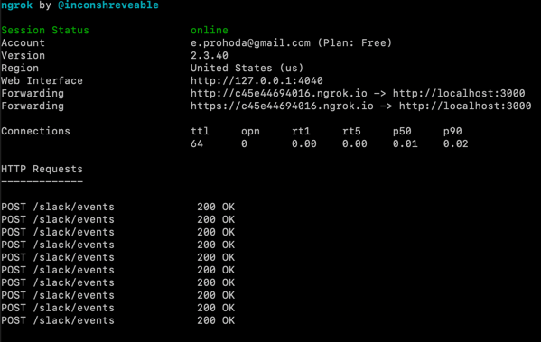
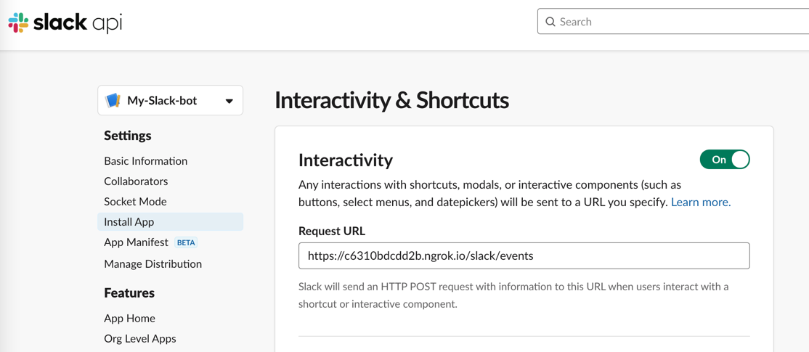
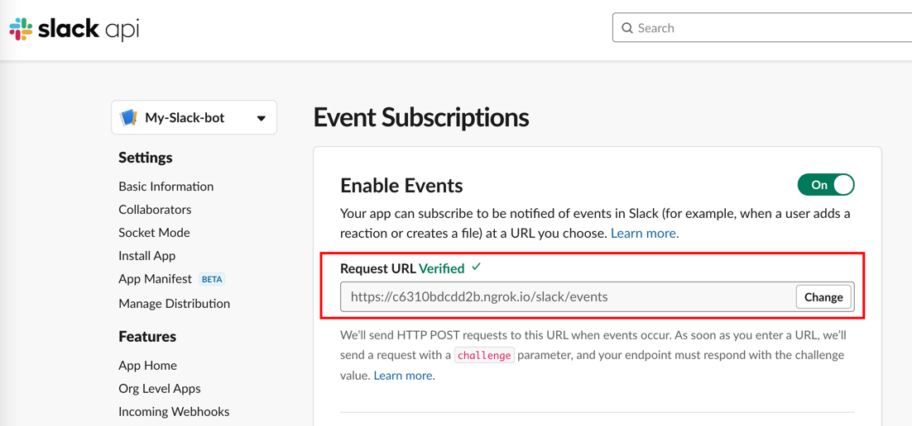
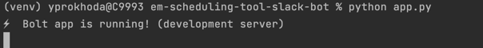
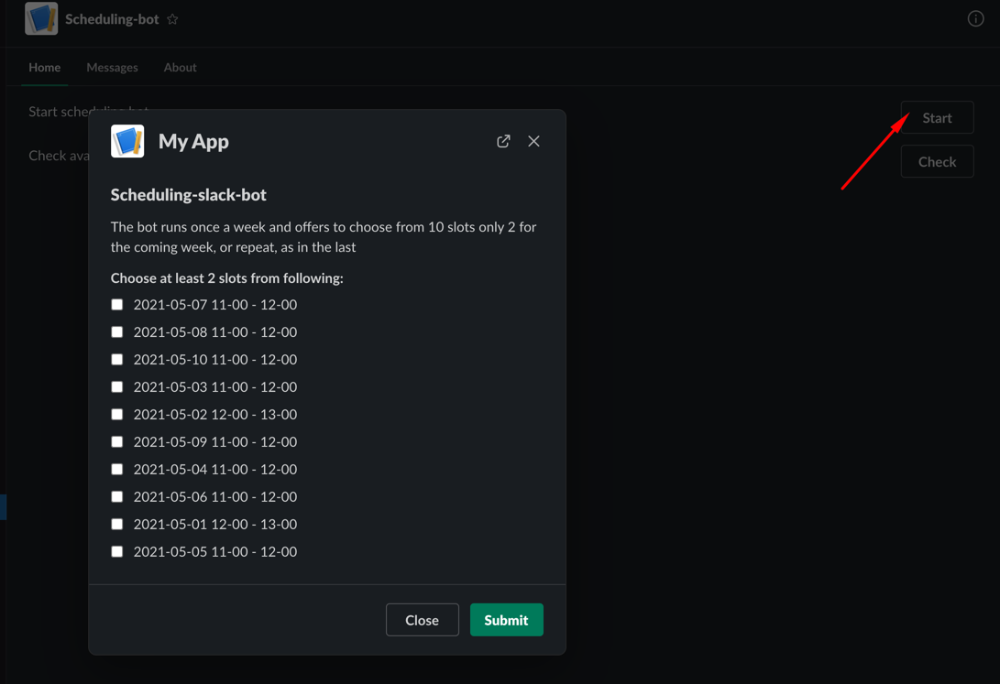
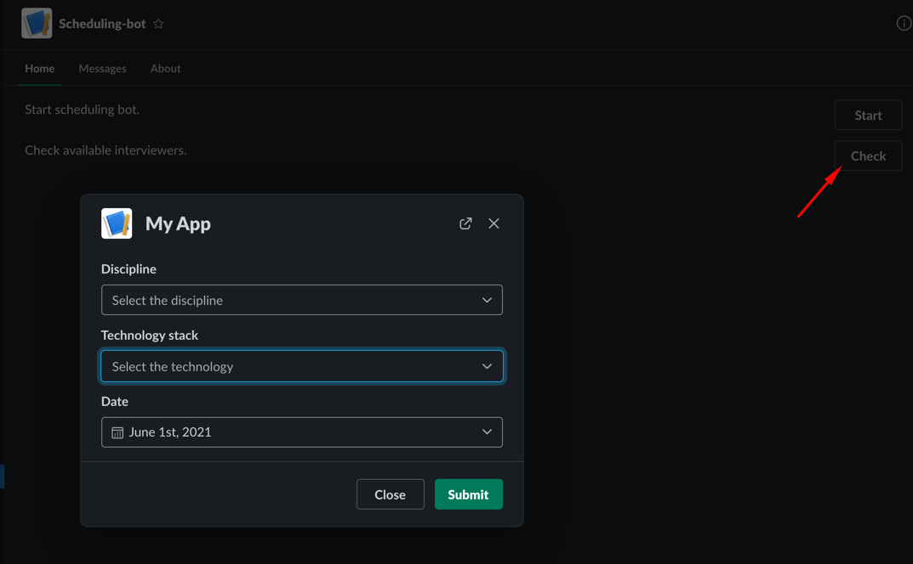

# em-scheduling-tool-slack-bot

##Prerequisites:
1. Clone project from [Github](https://github.com/griddynamics/em-scheduling-tool-slack-bot)
2. Put `.env` file in project root
3. Install requirement
`pip install requrements.txt`
   
4. Install [ngrok server](https://ngrok.com/) and run it on permanent basis to have public address instead of local.

   

##Install app to new workspace using manifests
Creating apps with manifests:
1. Click Create New App: https://api.slack.com/apps?new_app=1
2. Pick a development workspace and click Next
3. Paste your manifest configuration in the input field provided 
4. Change all _"request_url"_(s) to ngrok public ip and click Next
5. Review and verify that the configuration you entered matches the summary and click Create
6. Install new created bot to your workspace

## Config app
1. Add [collaborators](https://app.slack.com/app-settings/T021Y2J1L2K/A022VUNSVL1/collaborators)
   
2. Navigate to [interactive-messages page](https://api.slack.com/apps/A022VUNSVL1/interactive-messages?)

Double check or change Request URL to ngrok public address e.g. https://c6310bdcdd2b.ngrok.io/slack/events
   

3. Navigate to [event-subscriptions page](https://api.slack.com/apps/A022VUNSVL1/event-subscriptions?)

Double check or change Request URL to ngrok public address e.g. https://c6310bdcdd2b.ngrok.io/slack/events

##RUN
####Always run this server application for getting response from Slack:
    python app.py 

####Run this to send direct invitation to all interviewer in database
    python send_notification.py

#TODO запук планировщика

##Useful links:
* [Github project](https://github.com/griddynamics/em-scheduling-tool-slack-bot)
* [Slack-bot documentation](https://docs.google.com/document/d/1NNvzWUx9H_EDCAE2Y0m8wQwGFdfnC2OYSwweE2mlUtc/edit?ts=60ab7658)
* [Amazon DynamoDB tables](https://eu-central-1.console.aws.amazon.com/dynamodbv2/home?region=eu-central-1#tables)
---
* [Slack Application page](https://api.slack.com/apps/A022VUNSVL1?created=1)
* [Slack Block Builder](https://app.slack.com/block-kit-builder/T021Y2J1L2K#%7B%22blocks%22:%5B%5D%7D)
* [Slack Bolt lib](https://slack.dev/bolt-python/tutorial/getting-started)

##Project Description
* db/* - methods to work with database and tables
* db/export/* - export data from table in json format (can be used for import #TBD)
* app.py - main app, should be run from Terminal along with ngrok server all the time
* data_filters.py - methods to filter data in db
* data_forms.py - block forms for slack
* helper.py - helper methods and task scheduler
* manifest.json - config file to create a new bot on a new workspace
* send_notification - sends direct invitation to interviewers (manually or by task scheduler)

##App features
1. HR can send direct invitation to interviewers manually or by task scheduler
2. Interviewer can select 2+ timeslots of 10 for each week
   
3. HR can look for available interviewers by date, discipline and technology
    
   
##Database
1. Tables:
   * interviews - contains detailed info about interviews
   * timeslots - contains detailed info about timeslots
   * timeslots_confirmed - contains ids of interviews and ids of confirmed timeslots
2. Tables can be recreated 
   * by import of exported json files or
   * by running create_*_table() methods 
3. HR should edit timeslots and interviews before sending.