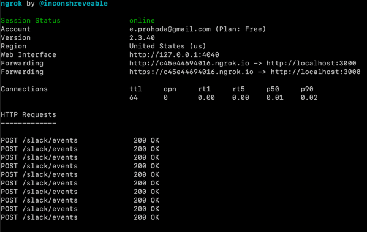
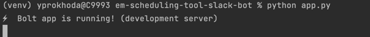

# em-scheduling-tool-slack-bot
[IT-80997]

##Prerequisites:
1. Clone project from [Github](https://github.com/griddynamics/em-scheduling-tool-slack-bot)
2. Put `.env` file in project root
3. Install requirement
`pip install requrements.txt`
   
4. Install [ngrok server](https://ngrok.com/) and run it on permanent basis to have public address instead of local.

##RUN
####Always run this server application for getting response from Slack:
    python app.py 

####Run this to send DM with invitation to select date
    python slackbot.py

##Useful links:
* [Github project](https://github.com/griddynamics/em-scheduling-tool-slack-bot)
* [Slack-bot documentation](https://docs.google.com/document/d/1NNvzWUx9H_EDCAE2Y0m8wQwGFdfnC2OYSwweE2mlUtc/edit?ts=60ab7658)
* [Amazon DynamoDB tables](https://eu-central-1.console.aws.amazon.com/dynamodbv2/home?region=eu-central-1#tables)
---
* [Slack Application page](https://api.slack.com/apps/A022VUNSVL1?created=1)
* [Slack Block Builder](https://app.slack.com/block-kit-builder/T021Y2J1L2K#%7B%22blocks%22:%5B%5D%7D)
* [Slack Bolt lib](https://slack.dev/bolt-python/tutorial/getting-started)

##Project Description
* db/* - methods to work with database and tables
* app.py - main app, should be run from Terminal along with ngrok server all the time
* data.py - block forms for slack
* helper.py - helper methods and task scheduler 
* slackbot - send invitation to interviewers in DM, manually or by task scheduler